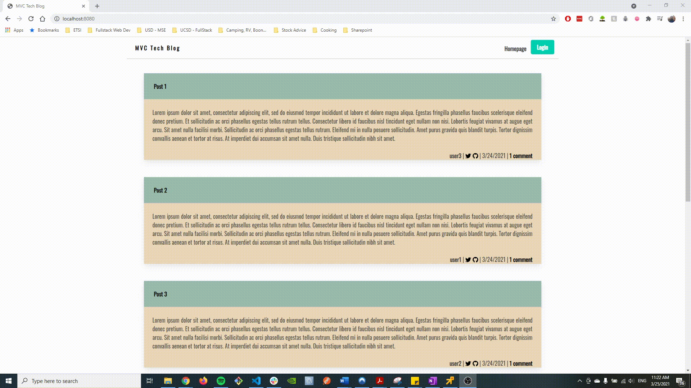
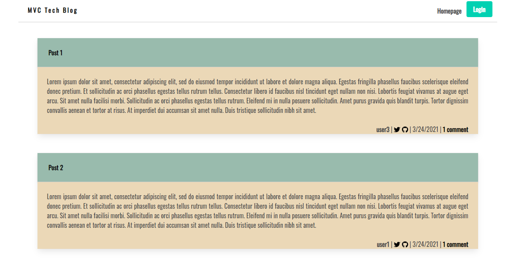
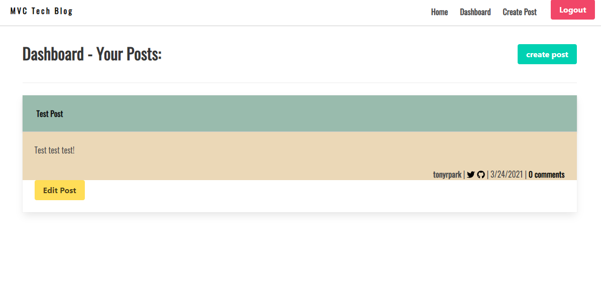

# Screenshots:

1. GIF of Entire App
   )

2. Add/Delete Post
    
   

3. Screenshot of Blog
    
   

4. Screenshot of Dashboard Page
    
   

# Technologies Used

- Handlebars
- Express.js
- Node.js
- Bootstrap
- Favicon
- MySQL
- Heroku

## Major Elements

-Models
-Views
-Controllers

### Installation and Setup

- Run 'npm i' before install
- Port is set to 3306 on MySQL and 8080 on client side
- Ensure .env file is at root

© Tony Park 2021
