# PROJECT #2

Project team: Tony, Mike, Robert, Omar
Project Name: Ludicrous Landslide Group
Project name and Summary: Ms. New Foodie, a Foodie app for real Foodies.

# Screenshots:

1. GIF of App 1
   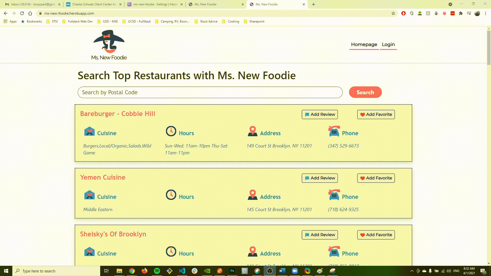

2. GIF of App 2
   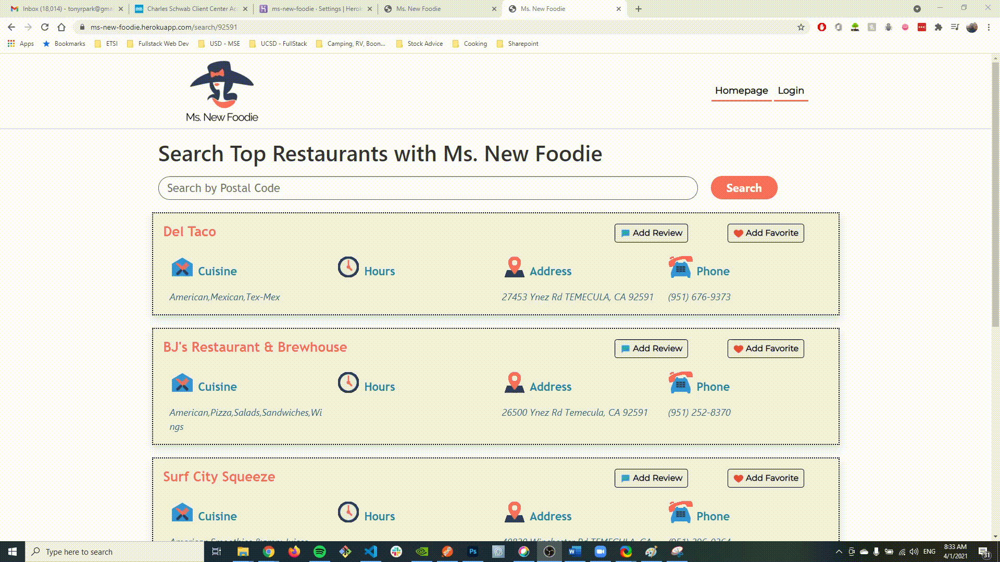

3. Screenshot of App 1
    
   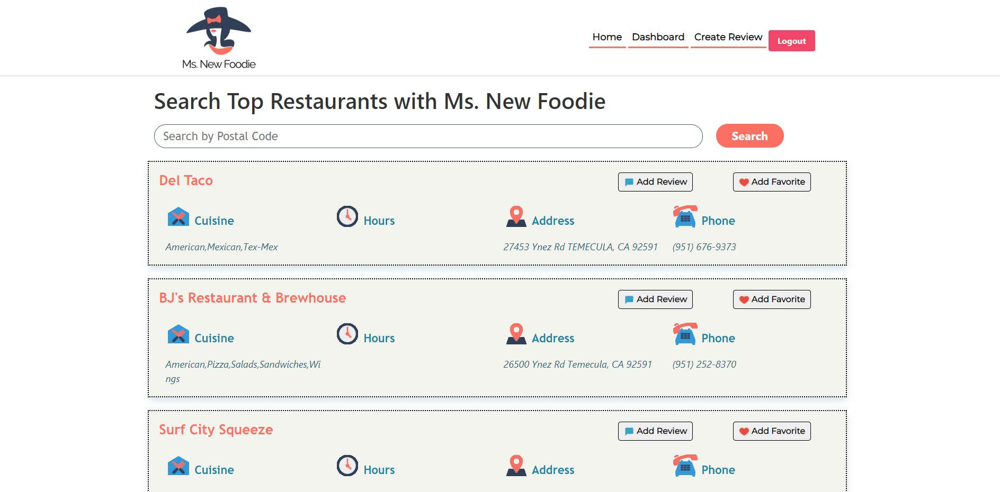

4. Screenshot of App 2
    
   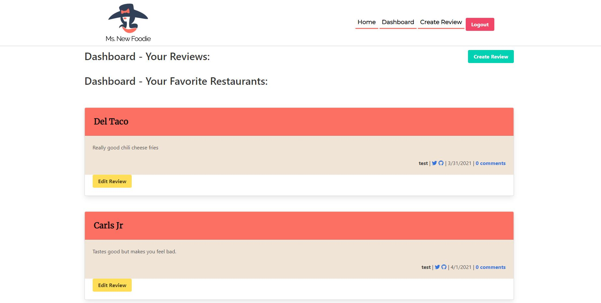

5. Screenshot of App 3
    
   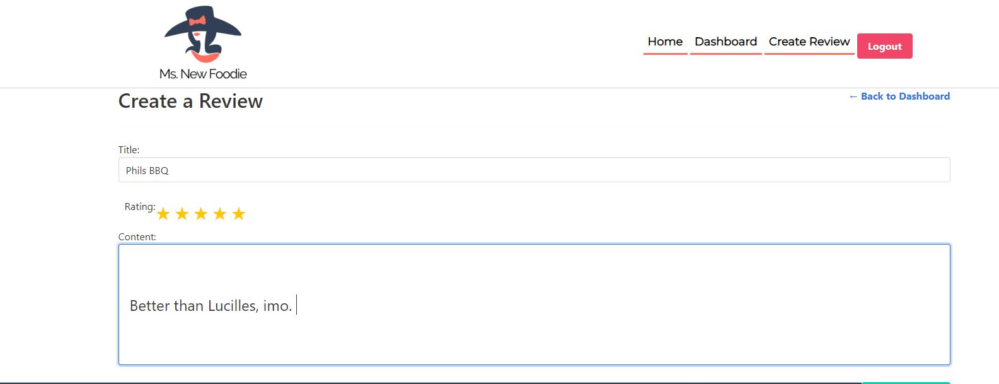

6. GET Request
    
   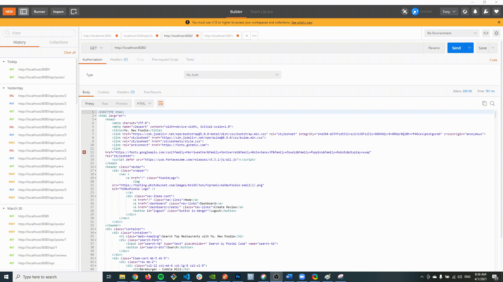

7. POST Request
    
   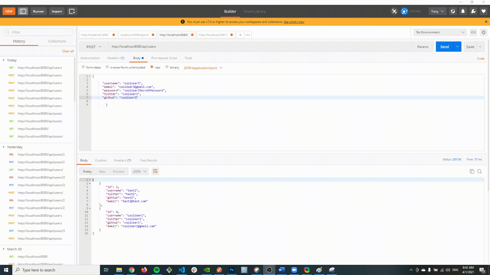

8. PUT Request
    
   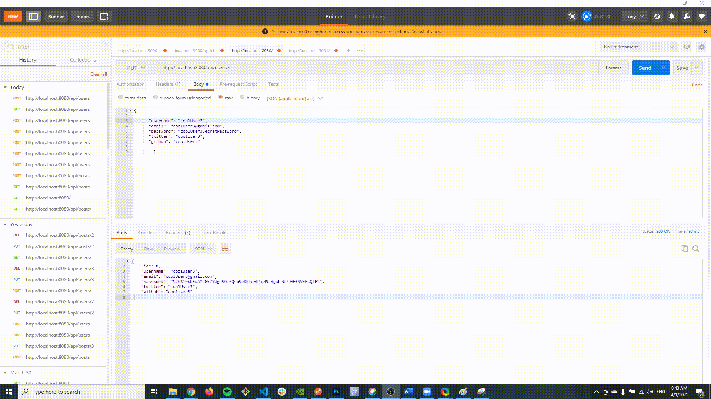

9. DELETE Request
    
   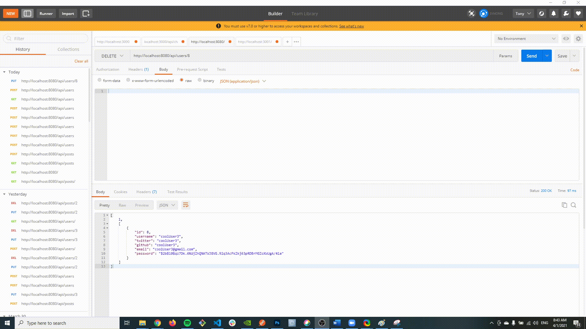

10. Login
     
    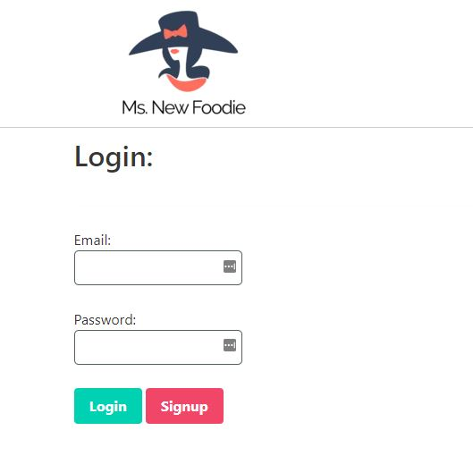

11. Signup
     
    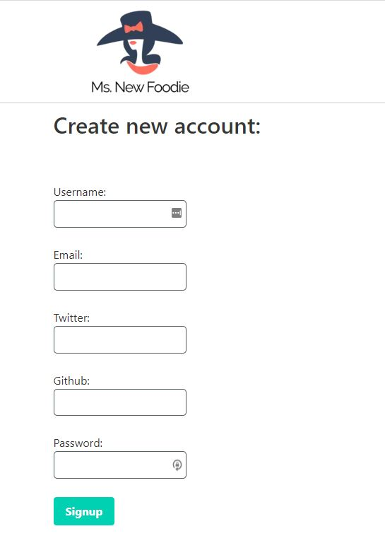

# Coding Requirements Hit

[x] Must use Node.js and Express.js to create a RESTFUL API  
[x] Must use Handlebars.js as the template engine  
[x] Must use MySQL and the Sequelize ORM for the database  
[x] Must have both GET and POST routes for retrieving and adding new data  
[x] Must use at least one new library, package, or technology that we haven't discussed --- Restaurant API, JawsDB, bulma package for style, nodemon for server refreshes  
[x] Must have a folder structure that meets the MVC paradigm  
[x] Must include authentication (express-session and cookies)  
[x] Must protect API keys and sensitive information with environment variables (bcrypt, jawsDB)  

# Additional Requirements

[x] Must be deployed using Heroku (with data)  
[x] Must have a polished UI  
[x] Must be responsive (check out our website on your mobile phone!)  
[x] Must be interactive  
[x] Must meet good-quality coding standards  
[x] Must have a professional README

# Technologies Used

- Express
- Sequelize
- JawsDB
- bcrypt
- Heroku
- Javascript
- HTML
- CSS
- OBS
- Restaurant API
- Bulma Package
- Bootstrap
- Adobe Photoshop
- mySQL Workbench
- mysql2
- axios
- express-handlebars
- express-session
- nodemon
- favicon
- unirest
- Postman
- ShareX

© Ludicrous Landslide Group 2021
